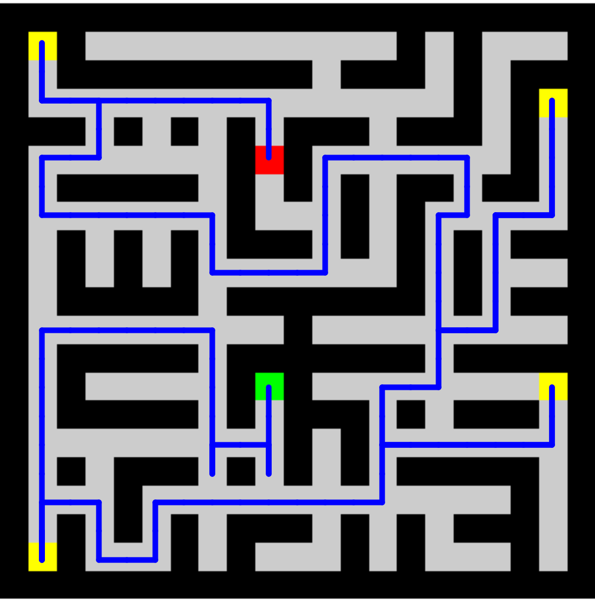

# Seminarska naloga o preiskovalnih grafih
Avtor: Mark Loboda

## Uvod
V seminarski nalogi sem preiskoval iskalne algoritme v grafih. Za preiskovalne primere sva uporabila labirinte, ki vsebujejo zaklade, katere mora algoritem najprej najti, nato pa mora priti do cilja.
Za implementacijo algoritmov sem uporabil programski jezik Java.

## Testni labirinti
Testnih labirintov je 9. Podani so v kvadratni matriki, kjer številke predstavljajo neko polje. Vsako polje, na katerega lahko stopiš in ni cilj, začetek ali zaklad vsebuje neko pozitivno število. To število predstavlja ceno, ki jo plača algoritem, da stopi nanj. To ceno upošteva od implementiraih algoritmov le A*.
Labirinti:
|  |  |  |  |  |
| :------------------------------------------------------------: | :------------------------------------------------------------: | -------------------------------------------------------------- | -------------------------------------------------------------- | -------------------------------------------------------------- |
|  |  |  |  |                                                                |

## Program za risanje
```java
    static void showPath(String imgPath, ArrayList<int[]> path, int x, int y)
     throws IOException, InterruptedException {
        BufferedImage bimg = ImageIO.read(new File(imgPath));
        int width = bimg.getWidth();
        int height = bimg.getHeight();

        double offsetX = ((width / x) / 2.0) / width;
        double offsetY = ((height / y) / 2.0) / height;

        StdDraw.setCanvasSize(width, height);
        StdDraw.picture(0.5, 0.5, imgPath);
        StdDraw.setPenColor(StdDraw.BLUE);
        StdDraw.setPenRadius(0.01);
        for (int i = 0; i < path.size() - 1; i++) {
            StdDraw.line(path.get(i)[1] * 1.0 / x + offsetX, 1 - path.get(i)[0] * 1.0 / x -
             offsetY, path.get(i + 1)[1] * 1.0 / x + offsetX, 1 - path.get(i + 1)[0] * 1.0 / x - offsetY);
            Thread.sleep(10);
        }
    }
```

## Dobljeni rezlutati z uporabo algoritmov

### 1. DFS - Depth-first search;
Algoritem je zgrajen tako, da ko pride do nekega zaklada išče naprej in ne poenostavi celotnega labirinta za razliko od drugih implementacij. Tako je bolj učinkovit, a v skrajnem primeru pride do napake.
Skrajni primer je tak, da ko je cilj najden pred najdbo zadnjega zaklada, se od zadnjega zaklada proti cilju vrne po celotni poti, ki jo je obiskal med najdbo cilja in zadnjega zaklada, tudi slepe ulice.

- Labirint 1:  
  
  - Cena poti:
  176
  - Koraki:
  49
- Labirint 2:  
  
  - Cena poti:
  548
  - Koraki:
  143
- Labirint 3:  
  
  - Cena poti:
  4148
  - Koraki:
  1053
- Labirint 4:  
  Tu je bila pot predolga in izrisovalnik STDDraw ni uspel narisati vsega. Zato slika ni dodana.
  - Cena poti:
  109135772
  - Koraki:
  28353002
- Labirint 5:  
  
  - Cena poti:
  84
  - Koraki:
  40
- Labirint 6:  
  
  - Cena poti:
  794
  - Koraki:
  337
- Labirint 7:  
  ž
  - Cena poti:
  972
  - Koraki:
  393
- Labirint 8:  
  Enako kot pri četrtem labirintu.
  - Cena poti:
  79533257
  - Koraki:
  28352996
- Labirint 9:  
  
  - Cena poti:
  552
  - Koraki:
  141


### 2. BFS - Breadth-first search

- Najdena pot do cilja
  - Labirint 1:  
    
    - Cena:
  140
    - Koraki:
  40
  - Labirint 2:  
    
    - Cena:
  412
    - Koraki:
  108
  - Labirint 3:  
    
    - Cena:
  1116
    - Koraki:
  284
  - Labirint 4:  
    
    - Cena:
  2496
    - Koraki:
  630
  - Labirint 5:  
    
    - Cena:
  84
    - Koraki:
  40
  - Labirint 6:  
    
    - Cena:
  168
    - Koraki:
  74
  - Labirint 7:  
    
    - Cena:
  612
    - Koraki:
  244
  - Labirint 8:  
    
    - Cena:
  1560
    - Koraki:
  624
  - Labirint 9:  
    
    - Cena:
  200
    - Koraki:
  53


### 3. IDDFS - Iterative Deepening Depth First Search

- Najdena pot do cilja
  - Labirint 1:  
    
    - Cena:
    144
    - Koraki:
    40
  - Labirint 2:  
    
    - Cena:
    380
    - Koraki:
    100
  - Labirint 3:  
    
    - Cena:
      1116
    - Koraki:
      284
  - Labirint 4:  
    
    - Cena:
      2496
    - Koraki:
      630
  - Labirint 5:  
    
    - Cena:
      84
    - Koraki:
      40
  - Labirint 6:  
    
    - Cena:
      187
    - Koraki:
      82
  - Labirint 7:  
    
    - Cena:
      640
    - Koraki:
      252
  - Labirint 8:  
    
    - Cena:
      1560
    - Koraki:
      624
  - Labirint 9:  
    
    - Cena:
      864
    - Koraki:
      288


### 4. A*

- Najdena pot do cilja
  - Labirint 1:  
    
    - Cena:
      140
    - Koraki:
      41
  - Labirint 2:  
    
    - Cena:
      412
    - Koraki:
      109
  - Labirint 3:  
    
    - Cena:
      1116
    - Koraki:
      285
  - Labirint 4:  
    
    - Cena:
      2496
    - Koraki:
      631
  - Labirint 5:  
    
    - Cena:
      84
    - Koraki:
      41
  - Labirint 6:  
    
    - Cena:
      157
    - Koraki:
      75
  - Labirint 7:  
    
    - Cena:
      621
    - Koraki:
      249
  - Labirint 8:  
    
    - Cena:
      1560
    - Koraki:
      625
  - Labirint 9:  
    
    - Cena:
      200
    - Koraki:
      54

## Statistika obdelave
- Število obdelanih vozlišč: atribut, ki pove, koliko vozlišč je algoritem pregledal

DFS - Java:

| Labirint   | Število obdelanih vozlišč | Čas izvajanja[ms] | Čas izvajanja[ns] |
| ---------- | :-----------------------: | :---------------: | :---------------: |
| Labirint 1 |            224            |         1         |         0         |
| Labirint 2 |           1402            |         0         |      1999900      |
| Labirint 3 |           6529            |         7         |      3003500      |
| Labirint 4 |         141799099         |       12184       |    11935792900    |
| Labirint 5 |            337            |         0         |         0         |
| Labirint 6 |           1214            |         0         |         0         |
| Labirint 7 |           5904            |         0         |      999800       |
| Labirint 8 |         141798927         |       13072       |    13622359400    |
| Labirint 9 |           1131            |         0         |         0         |


BFS - Java:

| Labirint   | Število obdelanih vozlišč | Čas izvajanja[ms] | Čas izvajanja[ns] |
| ---------- | :-----------------------: | :---------------: | :---------------: |
| Labirint 1 |            650            |         1         |      999600       |
| Labirint 2 |           3215            |         2         |      1999200      |
| Labirint 3 |           8770            |         4         |      2999700      |
| Labirint 4 |           23950           |         5         |      8999900      |
| Labirint 5 |            415            |         0         |         0         |
| Labirint 6 |           2140            |         1         |      6000400      |
| Labirint 7 |           8065            |         0         |      3000300      |
| Labirint 8 |           23795           |         8         |     10999600      |
| Labirint 9 |           2525            |         0         |      1002000      |


IDDFS - Java:

| Labirint   | Število obdelanih vozlišč | Čas izvajanja[ms] | Čas izvajanja[ns] |
| ---------- | :-----------------------: | :---------------: | :---------------: |
| Labirint 1 |           5681            |         1         |      2999800      |
| Labirint 2 |           36570           |        10         |     10997400      |
| Labirint 3 |          289930           |        40         |     39999400      |
| Labirint 4 |          2439040          |        371        |     267991300     |
| Labirint 5 |           4763            |         0         |      1000300      |
| Labirint 6 |           45988           |        13         |      1999700      |
| Labirint 7 |          257260           |        19         |     19999700      |
| Labirint 8 |          2368717          |        185        |     157996800     |
| Labirint 9 |           50197           |         2         |      2000000      |


A* - Java:

| Labirint   | Število obdelanih vozlišč | Čas izvajanja[ms] | Čas izvajanja[ns] |
| ---------- | :-----------------------: | :---------------: | :---------------: |
| Labirint 1 |            115            |         1         |         1         |
| Labirint 2 |            975            |         6         |         5         |
| Labirint 3 |           1537            |         5         |         5         |
| Labirint 4 |           4409            |        16         |        10         |
| Labirint 5 |            76             |         0         |         0         |
| Labirint 6 |            425            |         0         |         0         |
| Labirint 7 |           2031            |         1         |         4         |
| Labirint 8 |           4221            |        39         |        11         |
| Labirint 9 |           13018           |       16761       |       15116       |
